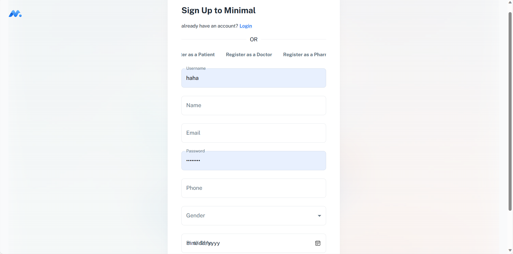
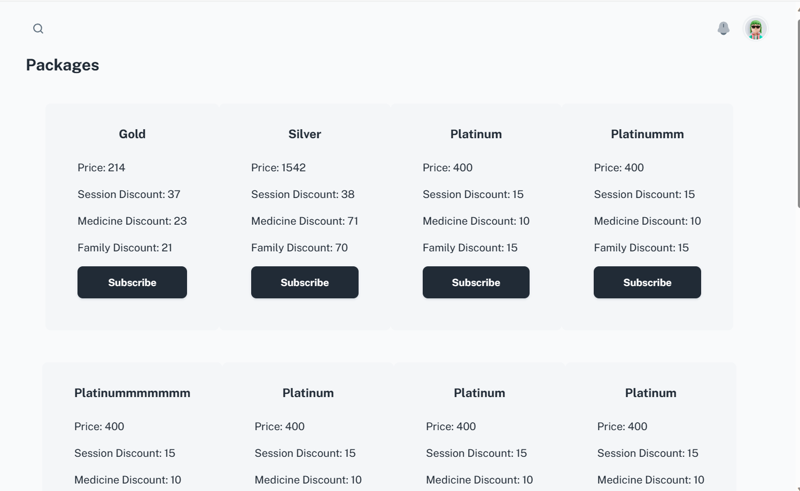
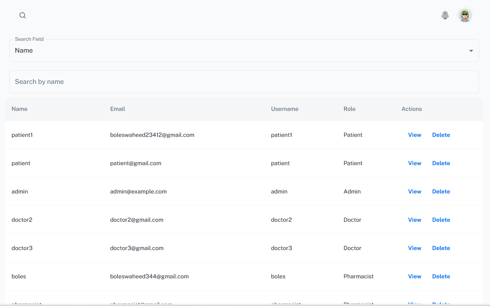
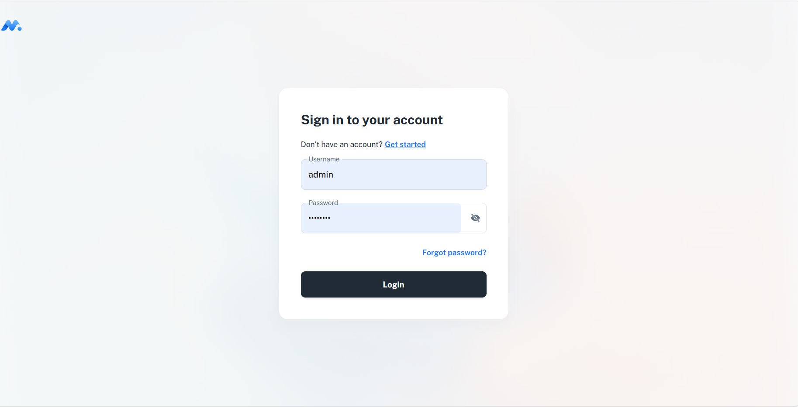
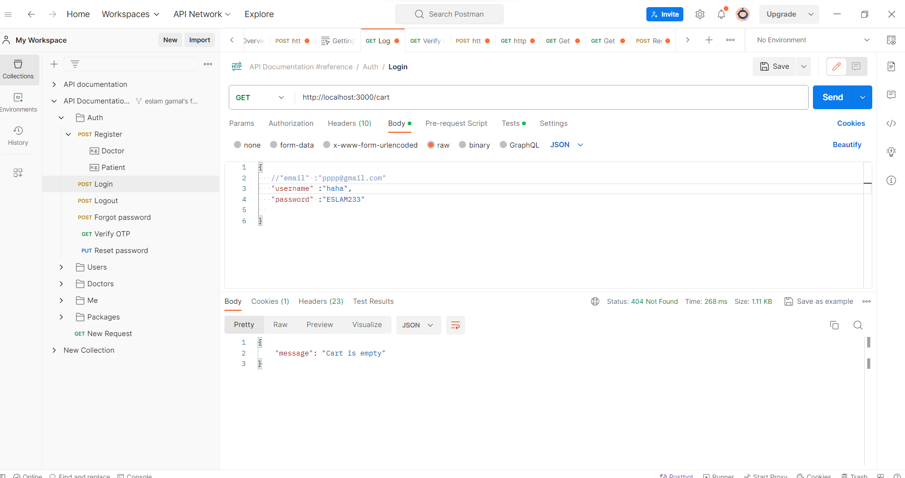
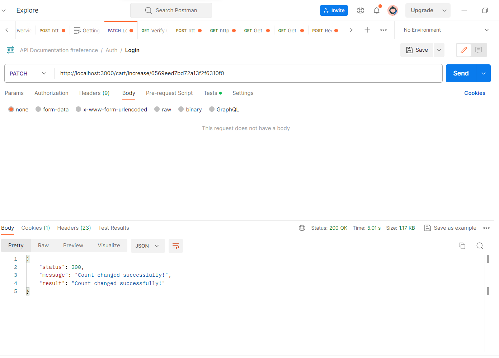
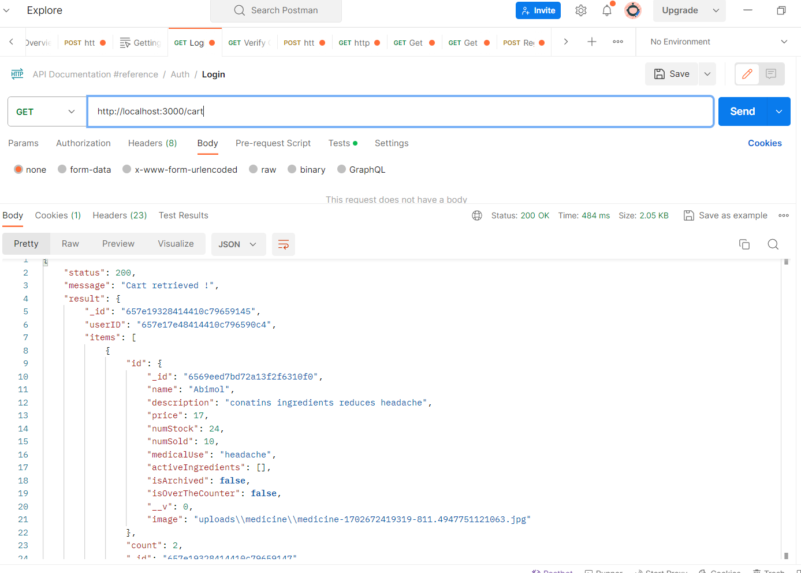
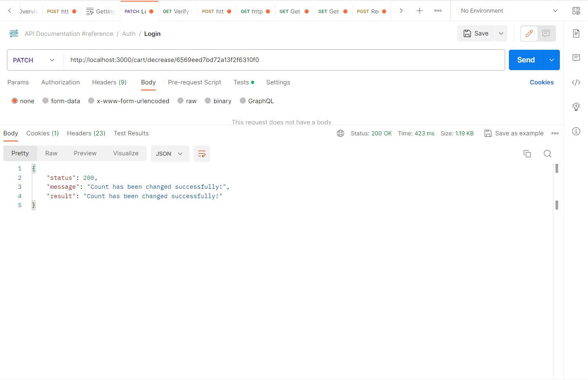
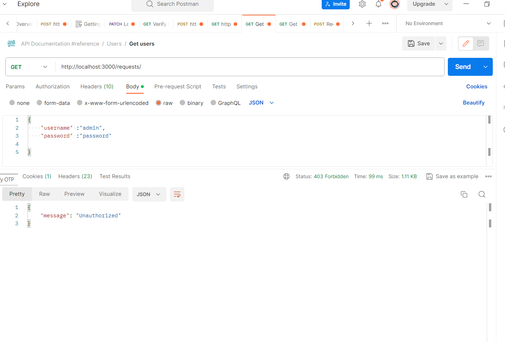

# El7a2ny _Virtual Pharmacy_
Powered by: _Code of Dudty1_

---

## Project Overview
El7a2ny Pharmacy represents an ambitious and innovative project t is being carried out as part of the German University in Cairo’s Media Engineering and Technology curriculum for the Winter 2023 semester. The project, which is overseen by Associate Professor Mervat Abuelkheir, This project is a natural progression from the successful El7a2ny Clinic, aiming to revolutionize the field of pharmaceutical care through a virtual platform. The focus of El7a2ny Pharmacy is to enhance and simplify the process of pharmaceutical care, making it more accessible and efficient for patients and pharmacists alike.

## Motivation

Motivation for El7a2ny Pharmacy
The inspiration for establishing the El7a2ny Pharmacy project stems from a profound commitment to reshaping the pharmaceutical landscape. Recognizing the evolving needs of the healthcare industry, our vision was to simplify and enhance the way patients manage their medication and interact with pharmacists. This project emerged from a desire to make pharmaceutical care more accessible, efficient, and patient-centric by leveraging the power of digital technology.
In a world increasingly reliant on technological advancements to elevate the standard of living, we identified an opportunity to apply digital innovation in bridging the gap between patients and pharmacists. Our driving force is to create an integrated online pharmacy platform that transcends traditional boundaries, offering a more efficient, holistic approach to medication management and pharmaceutical advice.


# Build Status 🔨

## Current State of the El7a2ny Pharmacy Project

As of the latest update, the El7a2ny Pharmacy project is progressing with several key developments and upcoming enhancements:

1. **Project Development Phase:**
   - The project is actively under development. Significant portions of the application, including core functionalities, are operational but are continually being improved.

2. **Unit Testing:**
   - The unit tests for various components of the project are in place but require modifications. These tests are crucial for ensuring the reliability and stability of the application.

3. **Caching Implementation:**
   - Plans are underway to integrate a caching layer. This enhancement aims to improve the performance and efficiency of the application, particularly in data retrieval processes.

4. **Payment Integration:**
   - The project roadmap includes the integration of additional payment methods. This will include Valu,instapay, telda  and other installment-based payment applications, expanding the range of payment options available to users.

5. **Additional Features and Optimizations:**
   - Ongoing work includes the addition of new features, user interface improvements, and backend optimizations to enhance the overall user experience and application performance.

## Upcoming !

- Finalizing and refining unit tests for increased code reliability.
- Implementing the caching layer for performance optimization.
- Integrating additional payment methods for user convenience.
- Continuous development of new features and functionalities.

---

*Note: The build status is subject to change as the project evolves. Stay tuned for further updates.*

## Tech/Framework Used🧰
In order to provide a reliable and effective virtual pharmacy solution, the El7a2ny project makes use of a contemporary technology stack. The principal technologies and frameworks integrated into the project are listed below:

- [MongoDB] : A NoSQL database used for storing and managing data.
- [React.js] : A JavaScript library for building user interfaces.
- [node.js] : A runtime environment for executing server-side JavaScript and TypeScript.
- [Express] : A web application framework for building APIs and server-side logic.
- [Mongoose](https://mongoosejs.com/): An elegant MongoDB object modeling tool for Node.js.
- [Jest](https://jestjs.io/): A delightful JavaScript testing framework with a focus on simplicity.
- [Stripe](https://stripe.com/): A technology company that provides payment processing solutions for online businesses.
- [TypeScript](https://www.typescriptlang.org/): A superset of JavaScript that adds static typing and other features.
- [Git](https://git-scm.com/): A distributed version control system for tracking changes in source code.
- [MongoDB Atlas](https://www.mongodb.com/cloud/atlas): A fully managed cloud database service for modern applications.
- [Postman](https://www.postman.com/): A collaboration platform for API development, testing, and management.
- [Visual Studio Code](https://code.visualstudio.com/): A lightweight and powerful code editor with excellent support for various programming languages.

Understanding these tools is essential for contributors and individuals interested in exploring or contributing to the El7a2ny project.


---

# El7a2ny Pharmacy Application Features

## Overview
El7a2ny Pharmacy is a comprehensive virtual clinic solution designed to streamline interactions between patients, pharmacists, and administrators.

## Key Features

### 1. Registration and Profile Management
- Guests can register as either patients or pharmacists, providing necessary personal and professional details.
- Secure profile creation with robust authentication measures, including password complexity requirements.

### 2. Secure Login System
- Allows users (Patients, Pharmacists, Administrators) to securely log in and log out of the system with their credentials.

### 3. Administrative Controls
- Administrators have the ability to manage user roles, including the addition of new administrators and the removal of existing users.
- Administrators can oversee pharmacist registration requests and have the authority to accept or reject these applications.

### 4. Document Management
- Pharmacists can upload essential documents, such as IDs and licenses, which are required for platform registration.

### 5. Medication Database
- Features a comprehensive list of available medicines, complete with details like images, prices, and descriptions.
- Pharmacists can view and manage inventory quantities and track medicine sales.

### 6. Search and Filter Options
- Users can efficiently search for medicines by name and filter results based on medicinal use or other attributes.

### 7. Medicine Management
- Pharmacists have the capability to add new medicines with detailed descriptions, manage inventory, and edit medicine information.

### 8. Sales and Reporting
- Enables the generation of sales reports for administrators and pharmacists, with options to filter by medicine or date.

### 9. User Privacy
- Administrators can access user information as needed but are restricted from viewing sensitive patient prescription data.

### 10. Shopping Cart Functionality
- Patients can add both over-the-counter and prescription medicines to their cart, manage quantities, and proceed to checkout.

### 11. Order and Delivery Management
- Patients can manage delivery addresses and choose from different payment methods, including digital wallets, credit card payments, and cash on delivery.

### 12. Order Tracking
- Provides the functionality to view current and past orders with detailed order status for patients.

### 13. Medicine Stock Alerts
- Pharmacists receive notifications when a medicine is out of stock.

### 14. Communication Tools
- Patients can chat with pharmacists, and pharmacists have the ability to communicate with doctors.

### 15. Financial Tracking
- Users can view the balance in their wallets, relevant for refunds or pharmacists’ salaries.

**These features collectively establish El7a2ny as a user-centric and efficient virtual clinic solution, enhancing the healthcare experience for all users.**

---

## Code Style📜

Maintaining a uniform code style is crucial for the readability and maintainability of our project. To achieve this, we utilize Prettier, a renowned code formatter, to enforce consistent coding standards automatically.

### Using Prettier for Uniform Code Formatting
[Prettier](https://prettier.io/) is an automated code formatter that applies predefined styling rules to your code. This tool streamlines the development process by eliminating the need for manual enforcement of style guidelines, fostering efficient and collaborative coding practices.

### Contributing to the Project
When contributing to this project, please ensure to format your code with Prettier before submitting a pull request. This practice helps maintain alignment with our coding standards, contributing to a cohesive and well-organized codebase.

### Setting Up Prettier
For information on setting up and integrating Prettier into your development workflow, refer to the [Prettier official documentation](https://prettier.io/docs/en/install.html). Consider configuring Prettier as a pre-commit hook in your version control system to automate the formatting process before each commit.

### Our Goal
By adhering to a consistent code style with the help of Prettier, we aim to enhance code readability, streamline team collaboration, and facilitate a more efficient development process.

---

## Code Examples 🐱‍💻

#**`` MongoDB Schema for Cart``**

Below is the MongoDB schema for the Cart model in the El7a2ny Pharmacy project:

```javascript
import mongoose, { Document, Schema } from 'mongoose';

// Interface defining the Cart document structure
interface ICart extends Document {
  userID: mongoose.Types.ObjectId;
  items: {
    id: mongoose.Types.ObjectId;
    count: number;
  }[];
}

// Schema definition for the Cart
const cartSchema = new Schema<ICart>(
  {
    userID: {
      type: mongoose.Schema.Types.ObjectId,
      ref: 'User',
      unique: true,
      required: true
    },
    items: [
      {
        id: {
          type: mongoose.Schema.Types.ObjectId,
          ref: 'Medicine',
          required: true
        },
        count: {
          type: Number,
          required: true
        }
      }
    ],
    default: []
  },
  { timestamps: true, toJSON: { virtuals: true }, toObject: { virtuals: true } }
);

// Index for efficient querying by userID
cartSchema.index({ userID: 1 }, { unique: true });

// Virtual field to calculate the total cost of the cart
cartSchema.virtual('total').get(async function (this: ICart) {
  await this.populate('items.id');
  return this.items.reduce(
    (acc, item) => acc + item.id.price * item.count,
    0
  );
});

// Cart model creation
const Cart = mongoose.model<ICart>('Cart', cartSchema);

export default Cart;
export { ICart };

***Express.js Route for getting the cart***
 router.get('/', (req: Request, res: Response) => {
  controller(res)(getCart)(req.decoded.id);
 });


```
#**``React Component for the forgetpassword page``**
```bash

import React, { useState } from 'react';
import Box from '@mui/material/Box';
import Stepper from '@mui/material/Stepper';
import Step from '@mui/material/Step';
import StepLabel from '@mui/material/StepLabel';
import Button from '@mui/material/Button';
import { alpha, useTheme } from '@mui/material/styles';
import Stack from '@mui/material/Stack';
import Card from '@mui/material/Card';
import Logo from 'src/components/logo';
import { bgGradient } from 'src/theme/css';
import EnterEmail from '../enter-email';
import EnterOTP from '../enter-otp';
import ResetPassword from '../reset-password';
import { useRouter } from 'src/routes/hooks';
const steps = ['Enter your email', 'Enter the OTP', 'Reset your password'];
export default function ForgotView() {
  const theme = useTheme();

  const router = useRouter();

  const [activeStep, setActiveStep] = useState(0);
  const [email, setEmail] = useState('');

  const handleNext = () => {
    setActiveStep((prevActiveStep) => prevActiveStep + 1);
  };

  const handleFinish = () => {
    router.push('/login');
  };

  return (
    <Box
      sx={{
        ...bgGradient({
          color: alpha(theme.palette.background.default, 0.9),
          imgUrl: '/assets/background/overlay_4.jpg'
        }),
        height: 1
      }}
    >
      <Logo
        sx={{
          position: 'fixed',
          top: { xs: 16, md: 24 },
          left: { xs: 16, md: 24 }
        }}
      />

      <Stack alignItems="center" justifyContent="center" spacing={20} sx={{ height: 1 }}>
        <Card
          sx={{
            p: 6,
            width: 1,
            maxWidth: 700,
            minHeight: 350
          }}
        >
          <Stepper activeStep={activeStep}>
            {steps.map((label, index) => {
              const stepProps = {};
              const labelProps = {};
              return (
                <Step key={label} {...stepProps}>
                  <StepLabel {...labelProps}>{label}</StepLabel>
                </Step>
              );
            })}
          </Stepper>

          <React.Fragment>
            <Stack direction="row" alignItems="center" justifyContent="center" sx={{ pt: 4 }}>
              {activeStep === 0 ? (
                <EnterEmail email={email} setEmail={setEmail} handleNext={handleNext} />
              ) : activeStep === 1 ? (
                <Stack>
                  <EnterOTP email={email} handleNext={handleNext} />

                  <Button color="inherit" disabled={activeStep != 1} onClick={() => setActiveStep(0)} sx={{ mr: 1 }}>
                    Back
                  </Button>
                </Stack>
              ) : (
                <ResetPassword email={email} handleFinish={handleFinish} />
              )}
            </Stack>
          </React.Fragment>
        </Card>
      </Stack>
    </Box>
  );
}
```

#**``Node.js Middleware for Authentication:``**
```
const isAuthenticated = async (req: Request, res: Response, next: NextFunction) => {
  try {
    const token = req.headers.authorization || req.cookies.token || req.query.token;

    // Verify the JWT token
    const decoded: any = token ? verifyToken(token) : undefined;
    const tokenValid = decoded ? await getRedis(decoded.id) : undefined;

    if (tokenValid) {
      req.decoded = decoded; // Store the decoded user information in the request
      return next();
    }

    res.status(StatusCodes.UNAUTHORIZED).json({ message: 'Not authenticated' });
  } catch (error: any) {
    console.error(error);
    res.status(StatusCodes.INTERNAL_SERVER_ERROR).json({ error: error.message });
  }
};
```

***Node.js service for getting the cart***

```bash
const acceptRequest = async (email: string) => { 
   const doctor = await User.findOne({ email }); 
   if (!doctor) throw new HttpError(StatusCodes.NOT_FOUND, 'Doctor not found'); 
  
   const request = await Request.findOneAndUpdate({ medicID: doctor._id }, { status: 'Approved' }); 
   if (!request) throw new HttpError(StatusCodes.NOT_FOUND, 'Request not found'); 
   if (request.status !== 'Pending') throw new HttpError(StatusCodes.BAD_REQUEST, 'Request is handled before'); 
  
   let endDate = new Date(); 
   endDate.setFullYear(endDate.getFullYear() + 1); 
  
   const contract = new Contract({ 
     doctorID: doctor._id, 
     startDate: new Date(), 
     endDate, 
     markUpProfit: 15 
   }); 
   await contract.save(); 
  
   return { 
     status: StatusCodes.OK, 
     message: 'Doctor approved successfully', 
     result: request 
   }; 
 };
```

---


## Installation📥

**Install the dependencies for the clinic webapp**
```sh
git clone https://github.com/advanced-computer-lab-2023/Code-of-Duty1-Pharmacy
cd server
npm install
cd ../client
npm install
```

 **Set Up Environment Variables:**
   - Create a `.env` file in the root of the project.
   - Add the necessary environment variables, such as database connection strings, API keys, etc.

---

## How to Use

Follow these steps to run the El7a2ny project on your local machine:
1. **To run backend**
   ```bash
   cd server && npm run start
   ```
2. **To run frontend**
   ```bash
   cd ../client && npm run dev
   ```

3. **Access the Application:**
   Open your web browser and go to [http://localhost:3000](http://localhost:3000) to access the El7a2ny project.
**(The backend server and client will be running on the specified ports on your env files ,so 3000 could change depends on the user).**
4. **Interact with the Features:**
   Explore the virtual pharmacy features, buying medecines , view cart , chat and video chat .

---

## Screenshots🖵






---
## API References

# El7a2ny Pharmacy API Documentation

Welcome to the El7a2ny Pharmacy API! This API allows for seamless interaction within our pharmacy management application, enabling functionalities such as user authentication, medicine management, order processing, and more.


## API Endpoints

### Authentication and User Management
- **Register User**
  - `POST /auth/register` - Registers a new user.
- **User Login**
  - `POST /auth/login` - Authenticates a user.
- **Forgot Password**
  - `POST /auth/forgot-password` - Initiates password recovery.
- **Verify OTP**
  - `POST /auth/verify-otp` - Verifies OTP for password reset.
- **Reset Password**
  - `PUT /auth/reset-password` - Resets a user's password.
- **Logout**
  - `POST /auth/logout` - Logs out the user.
- **Change Password**
  - `PUT /auth/change-password` - Allows password change for logged-in users.
- **User Management (Admin)**
  - `DELETE /users/:id` - Deletes a user.
  - `GET /users/:id` - Retrieves user details.
  - `POST /users/` - Adds a new admin.
  - `GET /Requests` - Views pharmacist registration requests.

### Medicine and Pharmacy Management (Pharmacist)
- **Medicine Management**
  - `POST /users/me/medicine` - Adds new medicine.
  - `PUT /users/me/medicine` - Updates medicine details.
  - `DELETE /users/me/medicine/:id` - Deletes a medicine.
- **Pharmacist Contract Management**
  - `GET /users/contract` - Views contract details.
  - `PUT /users/contract` - Updates contract status.
- **Medicine Database Access**
  - `GET /medicines` - Accesses the medicine database.

### Cart and Order Management
- **Cart Management(`/cart`)**
  - `GET /` - Retrieves user's cart.
  - `POST /` - Adds item to cart.
  - `DELETE /:id` - Removes item from cart.
  - `PATCH /increase/:id` - Increases item quantity.
  - `PATCH /decrease/:id` - Decreases item quantity.
- **Order Management(/orders)**
  - `GET /:id` - Retrieves specific order.
  - `GET /` - Retrieves orders based on user role.
  - `POST /` - Adds a new order.
  - `PUT /:id/cancel` - Cancels an order.
  - `PUT /:id` - Updates an order.
  - `GET /all` (Pharmacist) - Retrieves all orders.

### Personal User Information and Wallet (General User Routes)
- **Personal Information**
  - `GET /info` - Retrieves user information.
  - `PUT /info` - Updates user information.
- **Wallet Management(`/wallet`)**
  - `GET /wallet` - Views wallet balance.
  - `PUT /wallet` - Updates wallet balance.

### Payment and Subscription Management
- **Payment Session Creation**
  - `POST /session/subscription/:priceAmount/:productName` - Creates subscription session.
  - `POST /session/oneTimePayment` - Creates one-time payment session.
- **Payment Checkout**
  - `POST /payment/checkout` - Handles checkout process.

### Notifications and Reports
- **Notification Management(`/notifications`)**
  - `GET /:userID` - Retrieves user notifications.
- **Report Generation (Pharmacist)(`/report`)**
  - `GET /` - Generates and retrieves reports.

### Communication and Chat(`/chat`)
- **Chat and Communication (Various Roles)**
  - `GET /pharmacists` (Patient, Doctor) - Retrieves pharmacists' information.
  - `GET /pharmacists/doctors` (Pharmacist) - Retrieves doctors' information.
  - `GET /pharmacists/patient` (Pharmacist) - Retrieves patients' information.
  - `GET /room/:otherID` - Retrieves chat room messages.
  - `GET /room/:otherID/count` - Counts unseen messages.

### Requests Management (Admin)
- **Request Handling(`/requests`)**
  - `GET /` - Retrieves all requests.
  - `PUT /accept` - Accepts a request.
  - `PUT /reject` - Rejects a request.

---

## Notes
- Authentication is required for all routes.
- Authorization checks are implemented for routes specific to **Admins, Patients, and Pharmacists**.


---

## Tests

In the development of the El7a2ny project, testing plays a crucial role in ensuring the reliability and functionality of our application. We employ a combination of Postman and Jest to comprehensively cover different aspects of testing.

### Postman for Backend Testing
For backend testing, we extensively use Postman. It is a vital tool in our development process for:

- Validating the functionality of our API endpoints.
- Ensuring responses and payloads are accurate and as expected.
- Facilitating the creation and execution of test suites for various API routes, enhancing the consistency and reliability of our backend services.
- examples 
- 
-
-
-
-
-
-


### Jest for Partial Testing
While Jest, a delightful JavaScript testing framework, is utilized in our project, it's important to note that not all components and functionalities are currently covered by Jest tests. However, we have integrated some Jest tests which are instrumental in:

- Validating the logic of individual components and functions.
- Ensuring key functionalities perform as intended.
- Offering a foundation for future comprehensive test coverage as the project evolves.

### Running the Tests
To execute the tests, follow these guidelines:

**For Postman:**
- Make sure your local server or the relevant environment is running.
- Any route from our API Refrence file can be used for testing, 
for example: you can use the route "http://localhost:3000/me/wallet" to get the user's wallet info
- Execute the tests within each collection to validate the backend API functionality.

**For Jest:**
- Navigate to the root directory of the project.
- Run `npm test` to execute the available Jest test suites.

Our approach to testing, combining Postman for backend APIs and Jest for specific components, aims to strike a balance between thorough validation and development agility. Future iterations of the project will likely expand on the Jest test coverage for a more comprehensive testing suite.

---

## Contribute

We welcome contributions from the community to enhance the project. If you'd like to contribute, follow these steps:

1. **Fork the Repository:**
   Click the "Fork" button on the top right corner of the repository's GitHub page. This will create a copy of the repository in your GitHub account.

2. **Clone Your Fork:**
   ```bash
   git clone https://github.com/advanced-computer-lab-2023/Code-of-Duty1-Pharmacy
   ```

3. **Create a Branch:**
   ```bash
   cd server
   git checkout -b feature/your-feature
   ```

4. **Make Changes:**
   Make the necessary changes and improvements in your feature branch.

5. **Commit Changes:**
   ```bash
   git add .
   git commit -m "Add your concise commit message here"
   ```

6. **Push Changes:**
   ```bash
   git push origin feature/your-feature
   ```

7. **Submit a Pull Request:**
   Go to the GitHub page of your forked repository. Click on the "New Pull Request" button and submit your changes for review.

8. **Participate in Discussions:**
   Engage in discussions, provide feedback, and address any feedback received during the review process.

By following these steps, you contribute to the improvement of the project. Thank you for your valuable contribution!

---

## Credits

- [**Abdulrahman Fahmy**](https://www.linkedin.com/in/abdulrhman-fahmy) - Contributing Member
- [**Alaa Hisham**](https://www.linkedin.com/in/alaahisham) - Contributing Member
- [**Zeyad Hesham**](https://www.linkedin.com/in/zeyad-hesham-174941242/) - Contributing Member
- [**Ali Hussein**](https://www.linkedin.com/in/ali-adam-875653245) - Contributing Member
- [**Abdallah Bahaa**](http://linkedin.com/in/abdallah-khalil-a06237240) - Contributing Member
- [**Mark Mahrous**](https://www.linkedin.com/in/mark-mahrous-421186222/) - Contributing Member
- [**Eslam Gamal**](https://www.linkedin.com/in/eslam-gamal-895350204) - Contributing Member
- [**Yousef Badr**](https://www.linkedin.com/in/yousef-badr-81197629b/) - Contributing Member
- [**Boles waheed**](https://www.linkedin.com/in/boles-waheed-b9529622b) - Contributing Member
- [**Traversy Media YT Channel**](https://www.youtube.com/watch?v=-0exw-9YJBo&list=PLillGF-RfqbbQeVSccR9PGKHzPJSWqcsm) - Short MERN Stack playlist which provided significant help.

---

This Markdown formatted credits section lists the contributors to the El7a2ny Pharmacy project, linking to their professional profiles. Additionally, it acknowledges an external resource that provided valuable assistance.

## License

This project is dual-licensed under both the MIT License and the Apache License 2.0. Depending on your use case, you may choose to comply with the terms of either license.

- The **MIT License** is a permissive license that is short and to the point. It lets people do almost anything they want with your project, like making and distributing closed source versions, as long as they provide attribution back to you and don’t hold you liable.

- The **Apache License 2.0** also provides an express grant of patent rights from contributors to users. It is a permissive license, similar to the MIT License, but also provides an express grant of patent rights from contributors to users.

For more details, see the [LICENSE-MIT](LICENSE-MIT) and [LICENSE-APACHE](LICENSE-APACHE) files in this repository.


---

[//]: # (These are reference links used in the body of this note and get stripped out when the markdown processor does its job. There is no need to format nicely because it shouldn't be seen. Thanks SO - http://stackoverflow.com/questions/4823468/store-comments-in-markdown-syntax)
[MongoDB]: <https://www.mongodb.com/>
[React.js]: <https://react.dev/>
   [node.js]: <http://nodejs.org>
   [express]: <http://expressjs.com>
   [AngularJS]: <http://angularjs.org>


